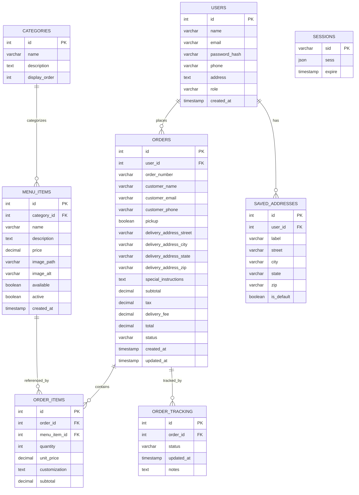

# Fast-Food Online Ordering & Delivery Tracking System

**CSE 340 Final Project** | Winter 2026

A full-stack web application for fast-food ordering with real-time delivery tracking. Customers browse menu, place orders, and track status via WebSocket. Admin dashboard for menu and order management.

## 🎯 Features

**Customer:**
- Browse menu by category
- Shopping cart (add/update/remove)
- Checkout with delivery address
- Real-time order tracking with live status updates

**Admin:**
- Add/edit/delete menu items
- View all orders
- Update order status (triggers real-time updates to customers)
- Simulated auto-progression for demo

**Kitchen:**
- Kitchen dashboard with live incoming order queue
- Update order status for real-time customer tracking
- Toggle menu item availability during service

**Authentication:**
- User registration and login
- Session-based with secure password hashing

## 🛠️ Tech Stack

| Layer | Technology |
|-------|-----------|
| **Frontend** | HTML5, CSS3, Vanilla JavaScript |
| **Backend** | Node.js, Express.js, EJS templates |
| **Database** | PostgreSQL (raw SQL, no ORM) |
| **Real-Time** | Socket.io (WebSocket) |
| **Auth** | bcrypt + express-session |

## 🚀 Quick Start

### Prerequisites
- Node.js v18+
- PostgreSQL v14+

### Installation

```bash
# Clone and install
git clone <repo>
cd cse340-final-konan
npm install

# Setup database
createdb fast_food_ordering
npm run setup-db

# Configure environment
cp .env.example .env
# Edit .env with your database credentials

# Start server
npm run dev
```

Visit `http://localhost:3000`
Live app: `https://cse340-final-konan.onrender.com`

### Test Accounts
- **User role**: test@example.com
- **Admin role**: admin@example.com
- **Kitchen role**: johndoe@email.com

## Database Diagram




## 📁 Project Structure

```
src/
├── controllers/        # Route handlers (menu, cart, order, account, admin)
├── models/            # Database models (menu, order, user)
├── views/             # EJS templates (menu, cart, order, account, admin)
├── middleware/        # Auth, validation, error handling
├── utils/             # Payment, email, address validation services
└── config/            # Database and Socket.io config

public/               # CSS, JavaScript, images
```

## 🔒 Security

- Passwords hashed with bcrypt (10 salt rounds)
- Parameterized SQL queries (SQL injection prevention)
- Session-based authentication with HttpOnly cookies
- Input validation and sanitization

## 🎓 Key Implementation Features

✅ Traditional MVC with server-side rendering  
✅ Real-time order tracking with WebSocket  
✅ Transaction-based order creation  
✅ Mock payment processing (demo)  
✅ Responsive mobile-first design  
✅ RESTful API with Postman tests  
✅ Category filtering and search  

## 📝 Development Workflow

```bash
npm run dev       # Start with nodemon
npm run setup-db  # Initialize database
npm run lint      # Check code with ESLint
npm run format    # Format with Prettier
```

## 👨‍💻 Author

**Konan Jean** | CSE 340 - Web Backend Development | Winter 2026
